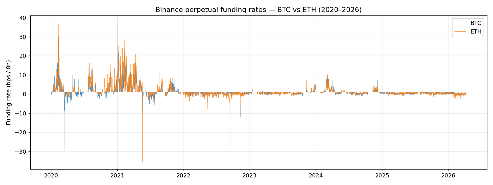
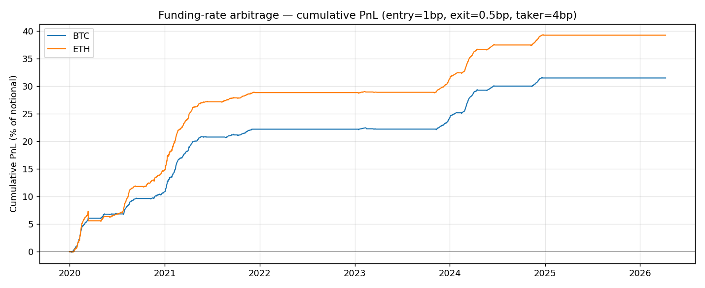
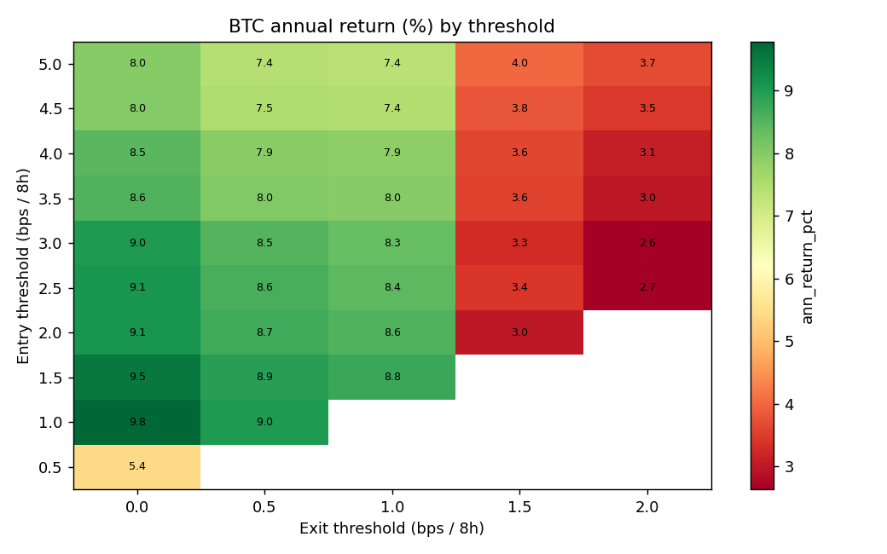
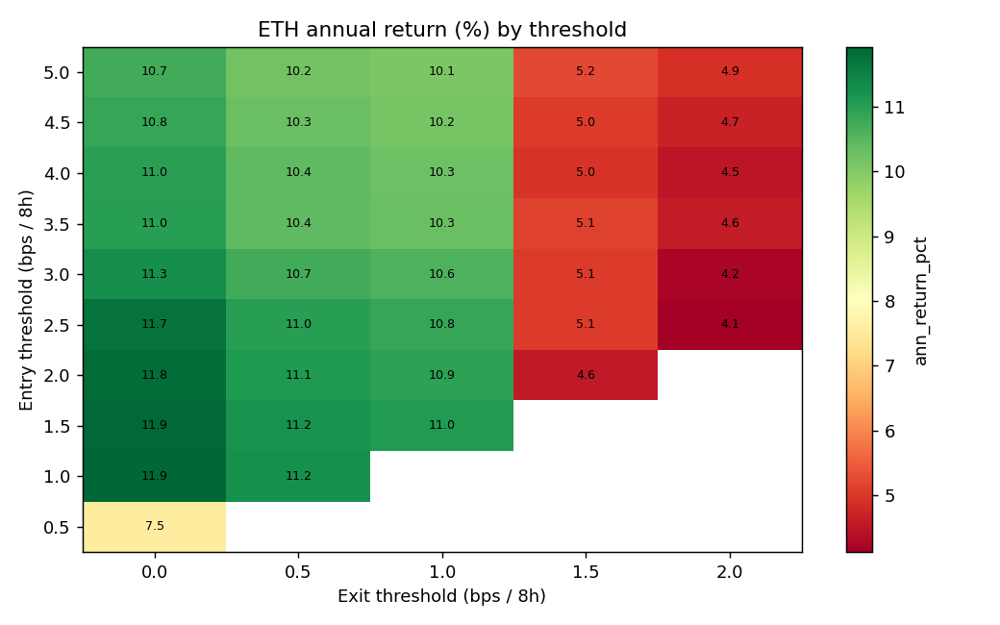
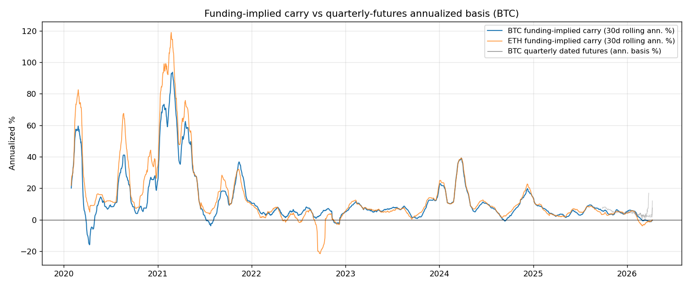

# Crypto Funding Rate Arbitrage

Independent research project on carry harvesting in crypto perpetual-swap markets.

**Question.** How profitable is a delta-neutral `long spot + short perpetual` carry trade across BTC and ETH once realistic execution costs are applied, and how does it compare to a dated quarterly-futures basis trade?

**Data.** Binance spot, perpetual swap, funding-rate (8h), and USDT-margined quarterly futures, 2020-01-01 → 2026-04-09, pulled via `ccxt`. All raw CSVs live in `data/raw/`.

---

## Summary of Findings



### 1. Funding rates are strongly right-skewed carry instruments

On an 8-hour bar (bps):

| Asset | Mean | Std | Annualized | Negative obs | Kurtosis |
|-------|-----:|----:|----------:|------------:|--------:|
| BTC   | 1.13 | 2.15 | **12.3 %** | 13.5 % | 30.1 |
| ETH   | 1.34 | 2.80 | **14.7 %** | 13.1 % | 37.9 |

- Distribution is heavily right-skewed (skew ≈ 3.3) with fat tails. Most of the gross carry concentrates in a small number of high-funding periods.
- ETH carries a persistent premium over BTC (≈2.3 %/yr on average) — shorts are compensated more for taking the basis side on ETH.

### 2. Regime matters — 2021 was exceptional, 2025 is weak

| Period | BTC ann. | ETH ann. |
|--------|---------:|---------:|
| 2020 COVID / recovery | 17.2 % | 27.4 % |
| 2021 bull | **30.6 %** | **37.5 %** |
| 2022 bear | 4.2 % | 0.8 % |
| 2023 chop | 7.9 % | 8.3 % |
| 2024 ETF bull | 11.9 % | 13.0 % |
| 2025+ | 4.3 % | 3.9 % |

The 2025 carry is only marginally above the 16bp round-trip fee cost, making the strategy highly regime-dependent.

### 3. No reversal signal from funding level

BTC forward returns by funding quintile:

| Quintile | r₁ (%) | r₃ (%) | r₇ (%) |
|----------|-------:|-------:|-------:|
| Q1 low | 0.47 | 1.09 | 2.19 |
| Q2 | 0.00 | 0.42 | 0.67 |
| Q3 | 0.15 | −0.13 | −0.21 |
| Q4 | 0.12 | 0.46 | 1.70 |
| **Q5 high** | 0.02 | 0.38 | 0.88 |

High funding does **not** predict price reversal — the carry trade can be exited on funding decay without needing a directional overlay.

### 4. Funding-rate arbitrage strategy (Part 3)

Rule: enter long-spot + short-perp when 8h funding > `entry_bps`, exit when it falls below `exit_bps`. Taker fees 4 bps per side per leg (16 bps round-trip).

Default config (entry = 1 bp, exit = 0.5 bp, taker = 4 bps):

| Metric | BTC | ETH |
|--------|----:|----:|
| # trades | 16 | 12 |
| Exposure | 31.7 % | 36.9 % |
| **Annual return** | **9.0 %** | **11.2 %** |
| Annual vol (8h-bar) | 0.96 % | 1.51 % |
| Max drawdown | −0.34 % | −1.80 % |
| Win rate | 87.5 % | 91.7 % |
| Avg hold (days) | 25 | 39 |



> **Sharpe caveat.** Raw Sharpe from 8-hour bars looks very high (7–10) because the strategy is flat ~60 % of the time, which compresses the denominator. This is *not* a fair risk-adjusted number. The honest statement is **"9–11 % annual carry at <2 % drawdown with ~35 % capital utilization"**, not an inflated Sharpe.

### 5. Threshold sensitivity (Part 4)

Scanned entry ∈ {0.5, 1, …, 5} bps × exit ∈ {0, 0.5, 1, 1.5, 2} bps.

Top BTC configurations by annual return:

| Entry | Exit | Ann % | # trades |
|------:|-----:|------:|---------:|
| 1.0 | 0.0 | 9.79 | 13 |
| 1.5 | 0.0 | 9.53 | 12 |
| 2.0 | 0.0 | 9.12 | 10 |
| 2.5 | 0.0 | 9.10 | 9 |

Top ETH configurations:

| Entry | Exit | Ann % | # trades |
|------:|-----:|------:|---------:|
| 1.0 | 0.0 | 11.92 | 11 |
| 1.5 | 0.0 | 11.89 | 11 |
| 2.0 | 0.0 | 11.80 | 10 |

**Key insight.** The strategy is **remarkably flat** in entry-threshold space between 1 and 3 bp — there is no "optimal threshold" to overfit to. What matters more is exit threshold: holding through minor funding dips (`exit = 0`) consistently outperforms early exits because funding decays are often brief.




### 6. Funding arb vs quarterly basis trade (Part 5)

Pulled active Binance USDT-M quarterly futures (3 contracts: 2026-03, 2026-06, 2026-09). Computed `(futures / spot − 1) × 365 / days_to_expiry`:

| Instrument | Mean ann. carry | Comment |
|------------|---------------:|---------|
| BTC funding-implied (2020–2026 avg) | **12.3 %** | Perp carry, full sample |
| BTC dated-futures basis (2026 contracts, current) | **4.3 %** | Observable only on active contracts |

**Why they differ in this snapshot.** We could only pull currently-active contracts; dated-futures basis in 2021–2022 was historically much higher (frequently 15–25 % annualized) but those contracts have expired and are not in the current Binance delivery history. The 4.3 % reading reflects the 2025 low-carry regime, not the long-run average.

**Structural comparison:**
- **Funding arb** = continuous carry, variable daily, exit any time, no settlement risk.
- **Basis trade** = fixed carry locked at entry, forced roll at expiry, settlement risk, usually less competitive than funding arb when funding > 0.



---

## Limitations

- **8h bar approximation.** Spot/perp marks are daily closes forward-filled to 8h. Intraday basis noise is hidden; real-time execution would add bps-level slippage.
- **Perfect delta hedge assumed.** Spot and perp are treated as 1:1 hedges at entry; actual leg-up slippage is ignored.
- **Single venue.** Binance only. Cross-venue funding spreads (Bybit / OKX / Deribit) are not considered and are where much of the institutional flow actually trades.
- **Historical quarterly-futures depth is limited** by Binance's delivery API — only active contracts retrievable, so the 2021–2022 basis-trade boom is not represented in the dated-futures comparison.
- **Sharpe is not reported as a headline** because 8h-bar Sharpe on a sparse-position strategy is mechanically inflated.

---

## Repository Structure

```
funding_rate_arb/
├── data/raw/               spot / perp / funding CSVs
├── src/
│   ├── data_fetcher.py     Part 1 — Binance pull via ccxt
│   ├── eda.py              Part 2 — descriptive stats, plots
│   ├── backtest.py         Part 3 — long spot / short perp carry
│   ├── sensitivity.py      Part 4 — threshold grid scan
│   └── basis_trade.py      Part 5 — dated-futures basis comparison
├── results/                metrics CSVs
│   └── figures/            8 plots
├── requirements.txt
└── README.md
```

## Reproduction

```
pip install -r requirements.txt
python src/data_fetcher.py     # ~2 min — Binance API
python src/eda.py
python src/backtest.py
python src/sensitivity.py      # ~1 min — grid scan
python src/basis_trade.py
```

## Disclaimer

Research and educational use only. Not investment advice. Past carry does not imply future carry — the 2025 regime shows just how thin the edge can get.
